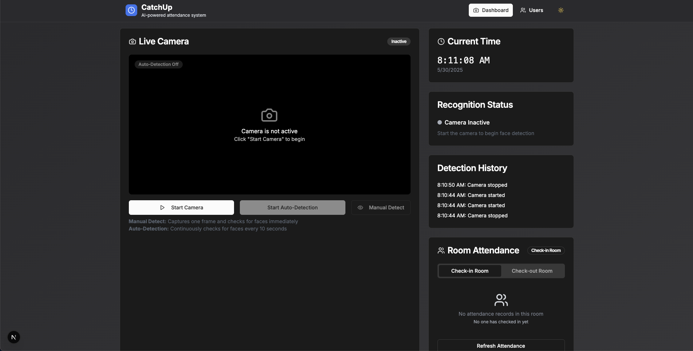

# AI Timekeeper - Facial Recognition Attendance System

[](https://vercel.com/akashi-projects/v0-face-recognition-timekeeper)
[](https://nextjs.org/)
[](https://www.mongodb.com/atlas/database)
[](https://luxand.cloud/)

## 📋 Overview

AI Timekeeper is an advanced facial recognition attendance system that uses the Luxand API to automatically detect, recognize, and record attendance. The application provides real-time feedback, attendance tracking, and a modern user interface for managing check-ins and check-outs.



## ✨ Features

- **Real-time Face Detection**: Capture and analyze faces using your device's camera
- **Facial Recognition**: Identify registered users with high confidence (>95%)
- **Automatic Attendance Recording**: Track check-ins and check-outs based on time of day
- **User Registration**: Register new faces for future recognition
- **Room Attendance Tracking**: View who has checked in/out of specific rooms
- **Voice Greetings**: Personalized voice greetings for recognized users
- **Responsive UI**: Modern, responsive interface built with Next.js and Tailwind CSS

## 🛠️ Tech Stack

- **Frontend**: Next.js 15, React, Tailwind CSS, shadcn/ui components
- **Backend**: Next.js API routes (serverless functions)
- **Database**: MongoDB Atlas for user data and attendance records
- **AI Services**:
  - Luxand Cloud API for facial recognition
  - OpenAI for generating personalized greetings
  - Text-to-speech for voice feedback
- **Deployment**: Vercel

## 🚀 Getting Started

### Prerequisites

- Node.js 18+ and npm/yarn
- MongoDB Atlas account
- Luxand API key (sign up at [Luxand Cloud](https://luxand.cloud/))
- OpenAI API key (optional, for greeting generation)

### Environment Variables

Create a `.env.local` file in the root directory with the following variables:

```
MONGODB_URI=your_mongodb_connection_string
LUXAND_API_KEY=your_luxand_api_key
OPENAI_API_KEY=your_openai_api_key (optional)
```

### Installation

1. Clone the repository:

```bash
git clone https://github.com/yourusername/ai-timekeeper.git
cd ai-timekeeper
```

2. Install dependencies:

```bash
npm install
# or
yarn install
```

3. Run the development server:

```bash
npm run dev
# or
yarn dev
```

4. Open [http://localhost:3000](http://localhost:3000) in your browser

## 📖 Usage

### Face Detection and Recognition

1. Start the camera by clicking the "Start Camera" button
2. Enable auto-detection or use manual detection
3. When a face is detected:
   - If recognized with >95% confidence, attendance is recorded
   - If not recognized, you can register the new face

### Check-in and Check-out

- Before 6 PM: System records check-ins
- After 6 PM: System records check-outs
- Room attendance is tracked in real-time

### Room Attendance

- Switch between check-in and check-out rooms using the tabs
- View who has checked in or out with timestamps
- Refresh to get the latest attendance data

## 🔧 API Endpoints

- `/api/detect-face-v2`: Detects and recognizes faces using Luxand API
- `/api/register-face`: Registers new faces in the system
- `/api/get-room-attendance`: Gets attendance data for specific rooms
- `/api/record-attendance`: Records attendance in the database
- `/api/generate-greeting`: Generates personalized greetings
- `/api/text-to-speech`: Converts greetings to speech

## 🤝 Contributing

Contributions are welcome! Please feel free to submit a Pull Request.

## 📄 License

This project is licensed under the MIT License - see the LICENSE file for details.

## 🙏 Acknowledgements

- [Luxand Cloud](https://luxand.cloud/) for facial recognition API
- [Next.js](https://nextjs.org/) for the React framework
- [Tailwind CSS](https://tailwindcss.com/) for styling
- [shadcn/ui](https://ui.shadcn.com/) for UI components
- [MongoDB](https://www.mongodb.com/) for database services
4. Vercel deploys the latest version from this repository